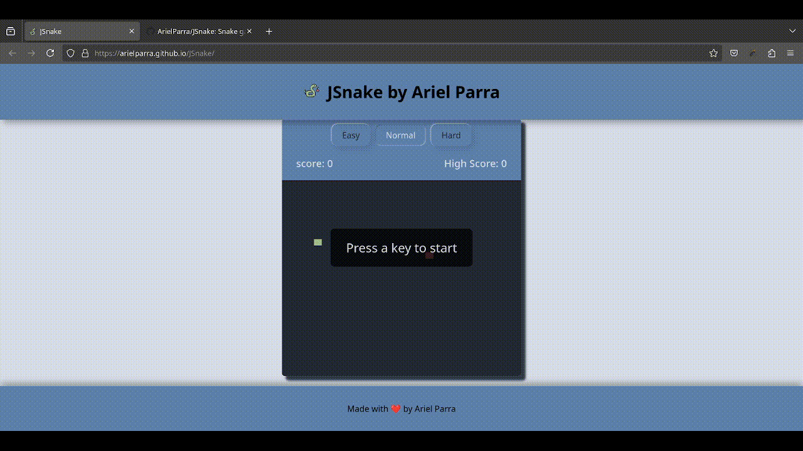

# JSnake

**JSnake** is the classic Snake game built with JavaScript + HTML + CSS using the [Nord color palette](https://www.nordtheme.com/). This lightweight game is an exciting way to pass the time, and it runs in any modern web browser on both PC and mobile devices.



## Features
- **Three Difficulty Levels**: Choose from Easy, Normal, or Hard to match your preferred challenge level.
- **Score Tracking**: Displays your current score and maintains your high score across sessions.
- **Controls**: Use arrow keys on PC or on-screen controls on mobile to move the snake.

## How It Works
JSnake uses **JavaScript DOM manipulation** to dynamically update the game interface, handle user input, and manage game elements, including:
- **Game Loop**: Continuously updates the snake's position and checks for collisions.
- **Score and High Score Display**: Updates the score in real time and saves the high score using local storage.

## Getting Started
1. Clone the repository:
   ```bash
   git clone https://github.com/ArielParra/JSnake.git
   ```
2. Open `index.html` in your favorite browser.
3. And press a key to start the game!

## Credits

- **`eat.mp3`** - Sound effect by Mark DiAngelo, licensed under [Attribution 3.0](https://creativecommons.org/licenses/by/3.0/). Available at [SoundBible](https://soundbible.com/2067-Blop.html).
- **`lose.mp3`** - Created by me (Ariel Parra) using the sound generator at [sfxr.me](https://sfxr.me/). Licensed under [CC BY 4.0](https://creativecommons.org/licenses/by/4.0/), allowing reuse with attribution.